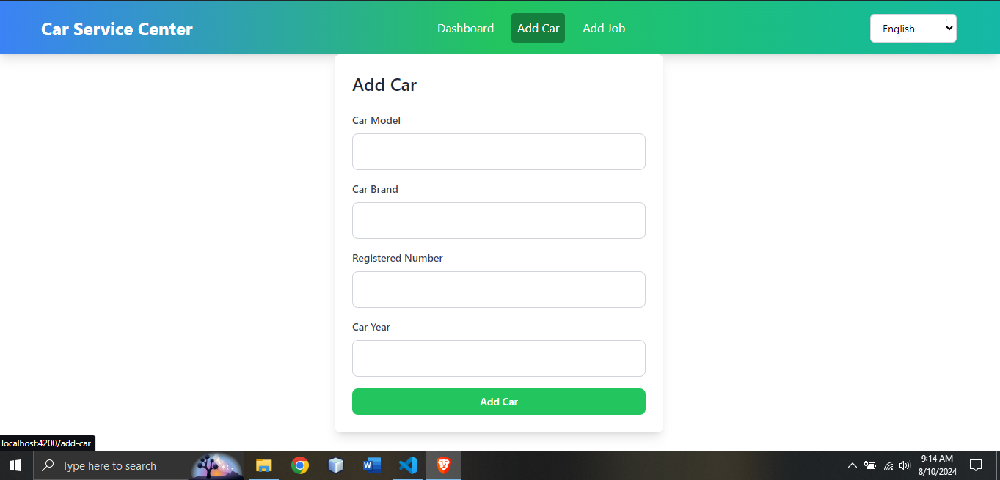
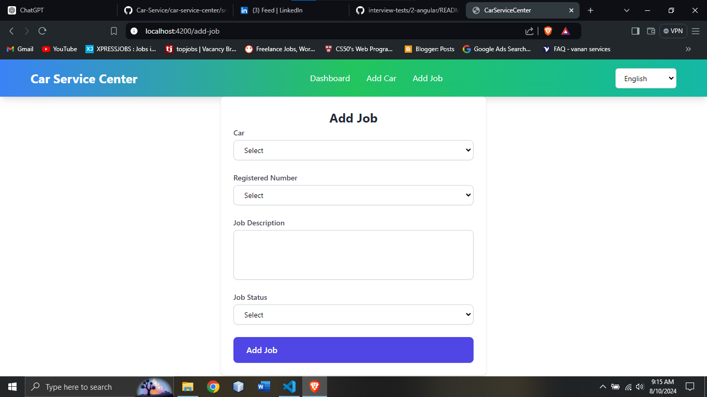
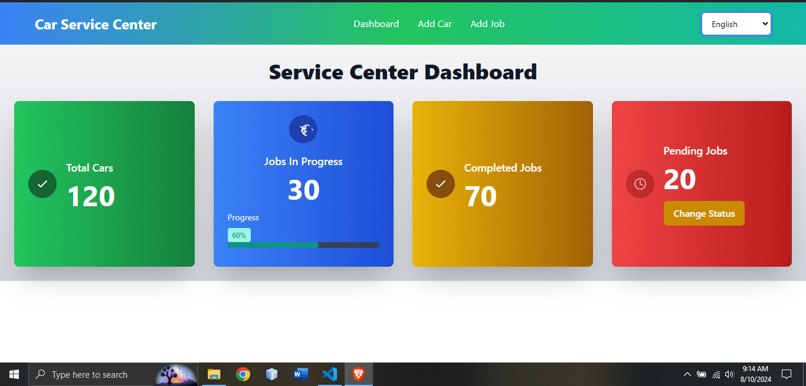
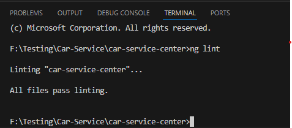
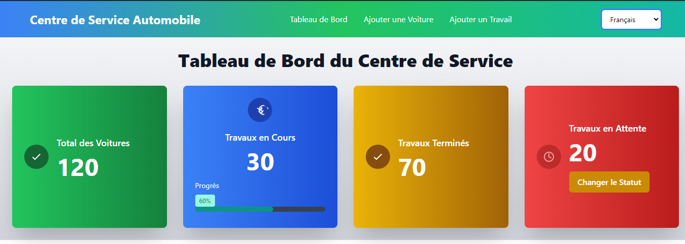
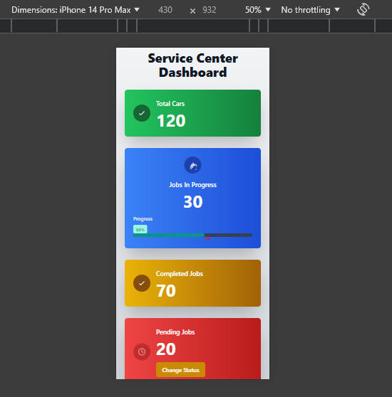

# Car Service Center UI

## Project Overview
This project is a UI for a car service center, built using Angular 18. It provides features for managing cars, tracking jobs, and displaying service statistics.

## Technologies Used
- **Angular 18**
- **Tailwind CSS with Sass**
- **Linting**: Ensures code quality and consistency.
- **Responsive Design**: Optimized for both desktop and mobile devices.
- **Latest Angular Features**: Utilized the newest capabilities and enhancements in Angular.

## Features
### Car Management
- Add new cars to the service center.

  
### Job Management
- Add jobs to cars.
- Quickly update job status while in progress through a select option. The dashboard also allows you to change the status of jobs in progress.


### Dashboard
- View the number of cars in the service center.
- Track jobs in progress and their statuses.
- Display detailed statistics related to car servicing.


### Linting
- All files pass linting.


### Environments
- **Development**
- **Staging**
- **Production**
- **Testing**

### Multilingual Support
- Language files are included to support multiple languages, enhancing the accessibility of the UI.


### Mobile View
- The UI is fully responsive and optimized for mobile devices.


## Getting Started
To get started with the project, follow the instructions below.

### Prerequisites
- Node.js and npm installed.

### Installation
1. Clone the repository.
2. Run `npm install` to install dependencies.
3. Set up the appropriate environment configuration.

### Running the Project
To run the project in different environments:
- **Development**: `ng serve --configuration=development`
- **Staging**: `ng serve --configuration=staging`
- **Production**: `ng serve --configuration=production`
- **Testing**: `ng serve --configuration=testing`

### Build
To build the project for production:
```bash
ng build --configuration=production
